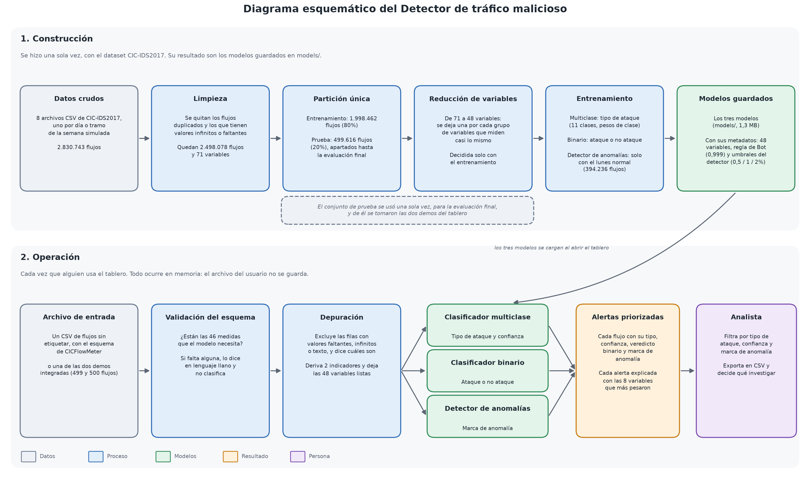

# Manual de usuario del Detector de tráfico malicioso

Proyecto final de la Maestría en Inteligencia Analítica de Datos, Universidad de
los Andes. Equipo: Mariana Pérez, Bryan Rodriguez y Daniela Zúñiga.

Aquí encontrarás qué hace el tablero, qué necesitas para usarlo y cómo sacarle
provecho paso a paso. Si vas a evaluar el proyecto, la forma recomendada es
usar las dos demostraciones que el tablero ya trae integradas (caso de uso 1),
que no exigen descargar ni subir nada.

| Dato | Valor |
|---|---|
| URL pública del tablero | [[PENDIENTE: URL]] |
| Navegadores | Chrome, Firefox o Edge de escritorio |
| Lectura estimada | Unos 15 minutos |
| Anexos | Diagrama esquemático, reporte técnico, tabla de requerimientos diligenciada, código y pruebas (ver [Anexos](#anexos)) |

**Contenido**

1. [Qué es y qué hace](#1-qué-es-y-qué-hace)
2. [Puesta en funcionamiento](#2-puesta-en-funcionamiento)
3. [Casos de uso](#3-casos-de-uso)
4. [Anexos](#anexos)

---

## 1. Qué es y qué hace

### 1.1 Para quién es

El tablero está pensado para el analista de seguridad de un SOC (centro de
operaciones de seguridad, el equipo que vigila la red de una organización). Ese
analista conoce redes y tipos de ataque, pero no es científico de datos ni
programador, y recibe más tráfico del que cualquier persona puede revisar a
mano. La herramienta le ayuda a decidir qué investigar primero y le entrega,
para cada alerta, una razón concreta que puede justificar ante otras personas.

El tablero trabaja con *flujos de red*. Un flujo es una conversación entre dos
computadores resumida en números: cuántos paquetes se enviaron, de qué tamaño,
con qué ritmo y cuánto duró. El tablero nunca ve el contenido de las
comunicaciones.

Los modelos se entrenaron con CIC-IDS2017, un dataset público del Canadian
Institute for Cybersecurity que simula una semana de tráfico en una red
corporativa, con 2.830.743 flujos etiquetados como tráfico normal o como uno de
14 tipos de ataque.

### 1.2 Qué recibe y qué devuelve

**Recibe** un archivo CSV (una tabla en texto que abre cualquier hoja de
cálculo) con flujos sin etiquetar y con el esquema de CICFlowMeter, la
herramienta gratuita que convierte el tráfico capturado en una tabla de flujos
con sus medidas. El tablero toma 46 de esas medidas y deriva otras 2, para un
total de 48 variables. Las columnas adicionales se ignoran, y si el archivo trae
la columna de etiqueta (`Label`) también se ignora y el tablero lo avisa.

**Devuelve**, para cada flujo, una fila con estas columnas (así aparecen en la
pantalla Alertas y en las descargas):

| Columna | Qué significa | Modelo que la produce |
|---|---|---|
| Fila del archivo | Posición del flujo en tu CSV (la primera fila de datos es la 1) | Ninguno, sale del archivo |
| Tipo de ataque (en la descarga completa, "Tipo asignado") | Normal o uno de 10 tipos de ataque | Clasificador multiclase |
| Confianza | Probabilidad que el modelo le asigna al tipo elegido: 99% quiere decir que casi no duda y 60% que la decisión estuvo reñida | Clasificador multiclase |
| ¿Ataque? y Prob. de ataque | Veredicto de ataque o normal, con su probabilidad | Clasificador binario |
| Anómalo y Score de anomalía | Si el flujo se sale del patrón del tráfico normal y qué tan raro es (más bajo, más raro) | Detector de anomalías |

Con esas filas, el Panel de resumen calcula cuántas alertas hay en el archivo y
cuánto se reduce la carga de revisión. Una *alerta* es un flujo al que el
clasificador multiclase le asignó algún tipo de ataque.

### 1.3 Los tres modelos

| Modelo | Pregunta que responde | Cómo está construido |
|---|---|---|
| Clasificador multiclase | ¿De qué tipo es este flujo? | HistGradientBoosting (cientos de árboles de decisión pequeños encadenados, donde cada uno corrige los errores del anterior) con pesos de clase, que hacen que equivocarse en una clase rara cueste más que equivocarse en la común. Distingue 11 clases: Normal y 10 tipos de ataque |
| Clasificador binario | ¿Es un ataque o no? | El mismo algoritmo, entrenado para dos clases |
| Detector de anomalías | ¿Este flujo se ve raro frente al tráfico normal, aunque no se sepa qué es? | Isolation Forest, un método que aísla cada flujo con cortes al azar (lo raro queda aislado en pocos cortes), entrenado solo con el tráfico del lunes, que es 100% normal |

Los 10 tipos de ataque son las denegaciones de servicio, que saturan un
servidor para dejarlo fuera de línea (DDoS y cuatro variantes de DoS), el
escaneo de puertos (PortScan), la fuerza bruta de contraseñas (FTP-Patator y
SSH-Patator), los ataques a aplicaciones web (Web Attack) y Bot, una máquina
infectada que un atacante controla a distancia. La sección 1.6 explica qué pasa
con los demás tipos del dataset.

### 1.4 Ventajas

| Ventaja | Efecto en el trabajo del SOC | Cómo lo logra |
|---|---|---|
| Reduce la carga de revisión | **Carga de revisión.** El analista revisa una fracción priorizada del lote en lugar de revisarlo todo. En la demo de proporción realista, el Panel de resumen pasa de 500 flujos por revisar a 23 alertas priorizadas, es decir, 95,4% menos revisión. | **Fatiga de alertas.** El modelo mantiene las falsas alarmas (flujos normales marcados como ataque) en 0,12% del tráfico normal y alcanza un macro-F1 de 0,975 sobre 499.616 flujos de prueba que nunca vio al entrenar. El macro-F1 promedia qué tan bien se detecta cada clase, pesando igual a la más común y a la más rara; como comparación, un modelo que dijera "todo es normal" apenas llega a 0,082. |
| Explica cada alerta | **Auditabilidad.** Cada alerta viene con una razón concreta que se puede revisar y explicar a otras personas. | SHAP, una técnica que reparte la "responsabilidad" de la decisión entre las variables del flujo, muestra las 8 que más pesaron en esa alerta y el valor que tenían. |
| Detecta sin etiquetas ataques no vistos | **Cobertura de amenazas.** Atrapa comportamientos raros que el clasificador no conoce. | Evaluado sobre el resto de la semana con un presupuesto de 1% de falsas alarmas, el detector encontró 89% de los flujos de Heartbleed (8 de 9), 52% de los de DoS slowloris y 48% de los de Infiltration (14 de 29) sin haber visto nunca un ataque. |
| No accede al contenido del tráfico | **Privacidad.** Se puede usar sin exponer las comunicaciones de la organización. | Usa solo medidas de comportamiento (tamaños, tiempos, conteos), sin direcciones IP ni contenido. El archivo se procesa en memoria y no se guarda. |
| No requiere instalación | **Disponibilidad.** Basta un navegador y la URL. | Tablero web publicado en [[PENDIENTE: URL]]. |

### 1.5 Cómo se fija el umbral del detector de anomalías

El detector le da a cada flujo un puntaje, el "Score de anomalía", que dice qué
tan normal se ve. Para decidir cuáles marcar hace falta un corte, y ese corte se
fija en cuatro pasos:

1. El detector se entrena solo con el tráfico del lunes, que es 100% benigno.
2. Luego puntúa ese mismo tráfico. Como sabemos que todo es normal, así se
   obtiene la distribución de puntajes del tráfico conocido normal.
3. El corte se fija en un percentil de esa distribución, es decir, en el
   puntaje por debajo del cual queda ese porcentaje de los flujos normales. Por
   construcción, ese porcentaje del tráfico conocido normal queda marcado.
4. Cualquier flujo de tu archivo con un puntaje por debajo del corte se marca
   como anómalo.

Por eso el umbral funciona como un **presupuesto explícito de falsas alarmas**,
y elegir 1% es aceptar que el detector se equivoque en 1 de cada 100 flujos
normales. El control **Presupuesto de falsas alarmas (umbral del detector)**
ofrece 0,5%, 1% (el valor inicial) y 2%. Un valor más bajo es más estricto
(menos falsas alarmas, pero atrapa menos) y uno más alto es más sensible
(atrapa más, con más falsas alarmas).

### 1.6 Limitaciones

1. **Errores de etiquetado en CIC-IDS2017.** Varios estudios documentan
   errores de etiquetado y de cálculo de variables en este dataset (Engelen et
   al., 2021; Rosay et al., 2022; Lanvin et al., 2023). Parte del tráfico
   marcado como normal podría contener ataques sin etiquetar, y eso afecta
   sobre todo al detector de anomalías, que se entrenó con el lunes suponiendo
   que todo era benigno. Fijar el umbral por percentiles lo mitiga, porque
   acepta desde el principio cierta contaminación, pero no la elimina.

2. **Heartbleed e Infiltration tienen muy pocos casos.** Son 11 y 36 flujos
   entre los 2,8 millones del dataset (2 y 7 en el conjunto de prueba), así que
   no hay métricas por clase confiables y el clasificador multiclase no los
   aprendió. Si uno de ellos aparece en tu archivo, el tipo que le asigne el
   multiclase será incorrecto por construcción. Por esta razón la herramienta
   combina tres modelos: el binario solo decide si hay ataque, y en la prueba
   marcó como ataque 2 de 2 flujos de Heartbleed y 3 de 7 de Infiltration
   (cifras ilustrativas, con muy pocos casos), y el detector de anomalías los
   busca sin necesitar etiquetas. Por el mismo motivo, los tres ataques web
   (fuerza bruta, XSS y SQL Injection, con 1.470, 652 y 21 casos) se agrupan en
   la familia Web Attack.

   **Nota:** un flujo al que el multiclase le asigna Normal no aparece en la
   pantalla Alertas, aunque el binario o el detector lo marquen. Para no
   perderlo, revisa la pantalla Detección de anomalías y la columna "¿Ataque?"
   de los **Resultados completos** que se descargan en Reportes (el caso de uso
   3 trae un ejemplo).

3. **El detector de anomalías es ciego a los ataques camuflados.** En la fuerza
   bruta de contraseñas (FTP-Patator y SSH-Patator), el escaneo de puertos
   (PortScan) y Bot, cada flujo por separado parece una conexión normal. Lo
   anómalo está en el conjunto (miles de conexiones casi idénticas en pocos
   minutos), y un detector que mira los flujos de a uno no lo puede ver. Su
   recall en esas familias fue prácticamente cero (el *recall* es la fracción
   de los ataques reales que el modelo encuentra). Esos ataques los cubre el
   clasificador supervisado, que aprendió a reconocerlos con ejemplos.

4. **La deriva temporal exige recalibrar.** El tráfico normal cambia con el
   tiempo, y a eso se le llama *deriva*. Con un presupuesto de 1%, casi todos
   los tramos de la semana quedaron entre 0,7% y 1,8% de falsas alarmas, pero
   un tramo de la tarde del viernes llegó a 9,6%. En un uso real habría que
   medir esa tasa periódicamente y volver a entrenar el detector con tráfico
   normal reciente cuando se aleje del presupuesto. El tablero muestra esa
   medición en la tabla "Falsas alarmas por día" de la pantalla Detección de
   anomalías.

5. **Tráfico simulado de 2017, sin garantía en otra red.** En esta red
   simulada cada ataque usa siempre su puerto típico (el *puerto de destino* es
   el número que identifica el servicio contactado, como el 80 para la web).
   Con el puerto el modelo logra 0,975 de macro-F1 y sin él logra 0,942, que es
   la estimación conservadora porque no depende de esa costumbre. Ninguna de
   las dos cifras garantiza el desempeño en otra red; eso solo se sabría
   evaluando el modelo con tráfico real de la organización.

6. **La regla de Bot usa un umbral muy alto.** El clasificador solo anuncia Bot
   si su probabilidad es de al menos 0,999; si no llega, asigna la segunda
   clase más probable. En la prueba, eso dejó una precisión de 0,947 (de las
   alarmas de Bot, la fracción que era Bot de verdad) y un recall de 0,728. Un
   umbral tan cerca de 1 es frágil: en la variante del modelo sin puerto,
   ninguna probabilidad de Bot llegó a 0,999 y la regla eliminó todas sus
   alarmas. En la práctica, algunos flujos de Bot quedan con tipo Normal, así
   que conviene mirar también la columna "¿Ataque?" del binario.

### 1.7 Advertencias

- **La herramienta prioriza y la decisión la toma el analista.** Ordena el
  trabajo y propone qué mirar primero. Que un flujo quede como Normal no
  garantiza que sea benigno, solo indica que no superó los criterios del
  modelo.
- **Opera por lotes.** Clasifica los archivos que tú cargas y no vigila el
  tráfico en tiempo real.
- **Exige el esquema de CICFlowMeter.** Si faltan columnas que el modelo
  necesita, el tablero dice cuáles faltan y no clasifica el archivo.
- **El historial dura solo la sesión.** Al cerrar el navegador se borran el
  historial y tu archivo, así que descarga lo que necesites conservar antes de
  salir.

---

## 2. Puesta en funcionamiento

### 2.1 Uso normal

1. Abre Chrome, Firefox o Edge en un computador de escritorio.
2. Entra a [[PENDIENTE: URL]]. No necesitas instalar nada.
3. Espera a que carguen los modelos. La primera carga tarda unos segundos y las
   siguientes son inmediatas. Si el tablero llevaba un tiempo sin uso, el
   alojamiento puede tardar un poco más en reanudarlo ([[PENDIENTE: tiempo de reanudación tras inactividad, medido en el tablero desplegado]]).
4. Sigue el caso de uso 1.

### 2.2 Conocimientos requeridos

| Necesitas | No necesitas |
|---|---|
| Saber qué es un flujo de red y reconocer los tipos de ataque habituales (denegación de servicio, escaneo de puertos, fuerza bruta, botnet) | Programar |
| Para analizar un archivo propio, saber exportar flujos con CICFlowMeter o pedírselos al equipo que captura el tráfico | Saber estadística ni aprendizaje de máquina, porque cada pantalla explica sus términos en lenguaje llano |

### 2.3 Ambiente tecnológico

| Para | Qué se necesita |
|---|---|
| Usar el tablero publicado | Un navegador de escritorio moderno (Chrome, Firefox o Edge) y conexión a internet. El tablero no está optimizado para celulares. |
| Correr el tablero en tu equipo | Python 3.13 en Windows, Linux o Mac con procesador Apple, y unos 300 MB de descarga para instalar sus dependencias. |
| Reproducir el análisis completo | Python 3.13, unos 8 GB de RAM (no hace falta GPU) y los 8 archivos CSV de CIC-IDS2017. Los tiempos que trae el README se midieron en una máquina de 24 núcleos y 32 GB de RAM; en un equipo modesto el proceso completo puede tardar varias horas. |

### 2.4 Instalación local (opcional)

Solo hace falta si quieres correr el tablero en tu propio equipo. El
[README](../README.md) trae el procedimiento completo y una tabla de problemas
frecuentes; aquí está el resumen.

Hay dos archivos de dependencias y se instala uno según el objetivo:
`requirements.txt` si solo quieres usar el tablero o correr las pruebas, y
`requirements-analisis.txt` si quieres reproducir el análisis (notebooks y
`src/`), que además incluye todo lo del tablero.

1. Instala Python 3.13 y abre una terminal (PowerShell en Windows, Terminal en
   Mac y Linux) en la carpeta del proyecto, la que contiene `streamlit_app.py`.
2. Crea el entorno del tablero (solo la primera vez). En Windows:

   ```powershell
   python -m venv .venv-app
   .venv-app\Scripts\python.exe -m pip install -r requirements.txt
   ```

   En Mac y Linux:

   ```bash
   python3 -m venv .venv-app
   .venv-app/bin/python -m pip install -r requirements.txt
   ```

3. Lanza el tablero con `.venv-app\Scripts\streamlit.exe run streamlit_app.py`
   en Windows o con `.venv-app/bin/streamlit run streamlit_app.py` en Mac y
   Linux.
4. Abre la dirección que aparece en la terminal, normalmente
   `http://localhost:8501`. La terminal tiene que quedar abierta mientras uses
   el tablero.
5. Para detenerlo, pulsa `Ctrl + C` en la terminal. Cerrar la pestaña del
   navegador no lo detiene.

**Nota:** en un Mac con procesador Intel no se puede instalar ninguno de los
dos entornos, porque SHAP depende de `numba` y `numba` ya no publica versiones
para esa plataforma con Python 3.13. En ese caso usa la URL pública.

**Nota:** en Windows, si la instalación falla con `OSError: [Errno 2] No such
file or directory` y una ruta muy larga, el motivo es que Windows limita las
rutas a 260 caracteres. Mueve la carpeta del proyecto a una ruta corta (por
ejemplo, una carpeta `proyectos` en la raíz del disco), borra la carpeta
`.venv-app` y repite el paso 2.

### 2.5 Actualización de los modelos

Los modelos de `models/` dependen de la versión exacta de scikit-learn (la
librería con la que se entrenaron), que es la **1.9.0** en `requirements.txt` y
en `requirements-analisis.txt`. Con otra versión, el tablero muestra al abrir
una advertencia amarilla y los resultados pueden fallar o cambiar. Para volver
a generar los modelos:

1. Instala el entorno del análisis (`requirements-analisis.txt`) sin cambiar la
   versión de scikit-learn.
2. Genera el conjunto de entrenamiento con los pasos 1 a 3 de "Reproducir el
   análisis" del [README](../README.md#reproducir-el-análisis), para lo cual
   necesitas los 8 CSV del dataset en `data/raw/`.
3. Mueve los tres archivos `.joblib` de `models/` a otra carpeta como respaldo.
   El script no vuelve a entrenar un modelo cuyo archivo ya existe.
4. Ejecuta `python -m src.modelo_final` con el Python de ese entorno.
5. Reinicia el tablero (`Ctrl + C` y volver a lanzarlo), porque guarda los
   modelos en memoria y no los vuelve a leer por su cuenta.

Si en algún momento se actualiza scikit-learn, hay que cambiarlo a la vez en
`requirements-analisis.txt` y en `requirements.in`, regenerar
`requirements.txt` con el comando de su encabezado y volver a generar los
modelos con estos pasos.

### 2.6 Recursos y licencias

Estas son las dependencias directas del tablero (las de `requirements.in`), con
la licencia que declara cada paquete instalado. Las dependencias indirectas
quedan fijadas en `requirements.txt`.

| Paquete | Versión | Para qué se usa | Licencia |
|---|---|---|---|
| streamlit | 1.63.0 | El tablero web | Apache-2.0 |
| scikit-learn | 1.9.0 | Los tres modelos | BSD-3-Clause |
| pandas | 2.3.3 | Lectura y manejo de tablas | BSD 3-Clause |
| numpy | 2.5.1 | Cálculo numérico | `BSD-3-Clause AND 0BSD AND MIT AND Zlib AND CC0-1.0` (el paquete incluye componentes con cada una) |
| joblib | 1.5.3 | Guardar y cargar los modelos | BSD-3-Clause |
| shap | 0.52.0 | La explicación de cada alerta | MIT |
| pytest | 9.1.1 | Las pruebas de los requerimientos | MIT |

Todas son licencias de código abierto permisivas, compatibles con el uso
académico del proyecto.

**Datos.** CIC-IDS2017 se descarga de
https://www.unb.ca/cic/datasets/ids-2017.html y su proveedor pide citarlo así:

> Sharafaldin, I., Habibi Lashkari, A. y Ghorbani, A. A. (2018). *Toward
> Generating a New Intrusion Detection Dataset and Intrusion Traffic
> Characterization*. 4th International Conference on Information Systems
> Security and Privacy (ICISSP), Portugal.

**Estudios citados en las limitaciones.**

- Engelen, G., Rimmer, V. y Joosen, W. (2021). *Troubleshooting an Intrusion
  Detection Dataset: the CICIDS2017 Case Study*. IEEE Security and Privacy
  Workshops.
- Rosay, A., et al. (2022). *Network Intrusion Detection: A Comprehensive
  Analysis of CIC-IDS2017*. ICISSP.
- Lanvin, M., et al. (2023). *Errors in the CICIDS2017 Dataset and the
  Significant Differences in Detection Performances It Makes*. CRiSIS 2022.

**Alojamiento.** [[PENDIENTE: servicio de alojamiento del tablero y sus condiciones de uso]]

---

## 3. Casos de uso

| Caso | Para qué sirve | ¿Necesita un archivo propio? |
|---|---|---|
| 1. Explorar el tablero con las dos demos (recomendado) | Ver todo lo que hace el tablero y comprobar sus resultados | No |
| 2. Investigar por qué se marcó una alerta | Tener una razón concreta para justificar una alerta | No |
| 3. Ajustar la sensibilidad del detector de anomalías | Elegir cuántas falsas alarmas acepta el equipo | No |
| 4. Analizar un archivo propio | Aplicar el tablero a tráfico de tu red | Sí |
| 5. Reproducir el análisis completo | Verificar el proyecto desde los datos crudos | No, pero necesita el dataset |

### Caso 1. Explorar el tablero con las dos demos (recomendado)

Las dos demos son muestras pequeñas de CIC-IDS2017 tomadas del conjunto de
prueba, es decir, de flujos que los modelos nunca vieron al entrenar. Vienen en
el mismo formato de CICFlowMeter que tendría un archivo real, sin la columna de
etiqueta, y se cargan con un botón, así que no hay que descargar ni subir nada.

| Demo | Archivo | Flujos | Ataque | Tipos de ataque | Para qué sirve |
|---|---|---|---|---|---|
| **Demo rica en ataques** | `data/demo/flujos_demo.csv` | 499 | 39,9% | 14 | Muestra todo lo que el sistema detecta, incluidos los ataques más raros |
| **Demo de proporción realista** | `data/demo/flujos_demo_realista.csv` | 500 | 5,0% | 10 | Muestra cuánto trabajo de revisión le ahorra al analista en un lote parecido al tráfico real |

1. Abre el tablero (sección 2.1).
2. En la barra lateral, debajo del cargador "CSV de flujos de red", busca
   "¿Sin archivo a la mano? Prueba con una demostración:" y haz clic en
   **Demo rica en ataques**.
3. En unos segundos el tablero valida y clasifica la demo. La barra lateral
   muestra "Archivo activo" con el nombre de la demo, y arriba de la pantalla
   aparece el recuadro plegado "Validación del archivo 'Demo rica en ataques'".
   Si lo abres, verás que las 499 filas quedaron listas para clasificar.
4. Recorre las pantallas desde la lista "Pantallas" de la barra lateral:

   | Pantalla | Qué mirar |
   |---|---|
   | Panel de resumen | Flujos cargados, alertas priorizadas, reducción de la carga de revisión y el gráfico de alertas por tipo de ataque |
   | Clasificación | Cómo quedó clasificada la demo y, más abajo, el resultado fijo del modelo en su prueba final, con la tabla por clase y la matriz de confusión |
   | Detección de anomalías | Los flujos que se salen del patrón normal y la tabla de falsas alarmas por día (caso de uso 3) |
   | Interpretabilidad | Qué variables pesan en general y por qué se marcó cada alerta (caso de uso 2) |
   | Alertas | La lista de alertas, sus filtros y la descarga en CSV |
   | Reportes | Las descargas y el historial de la sesión |

5. Haz clic en **Demo de proporción realista** y vuelve al Panel de resumen.
   Con 5,0% de ataque, el panel muestra 500 flujos cargados y 23 alertas
   priorizadas, es decir, una reducción de 95,4% en la carga de revisión.
6. Para comprobar un resultado, anota el número de la columna "Fila del
   archivo" en la pantalla Alertas y búscalo en el archivo de etiquetas de esa
   demo: [`data/demo/etiquetas_demo.csv`](../data/demo/etiquetas_demo.csv) para
   la rica y
   [`data/demo/etiquetas_demo_realista.csv`](../data/demo/etiquetas_demo_realista.csv)
   para la realista. Su columna `fila` usa la misma numeración del tablero y la
   columna `etiqueta_real` trae la respuesta correcta. El tablero no lee estos
   archivos, que están en el repositorio del proyecto solo para que puedas
   verificar los resultados fila por fila.

[[PENDIENTE: captura de la barra lateral con los botones de demo, docs/capturas/01_barra_lateral_demos.png]]

[[PENDIENTE: captura del Panel de resumen con la demo de proporción realista, docs/capturas/02_panel_resumen_realista.png]]

**Nota:** si comparas todas las filas, el tablero acierta si un flujo es ataque
o normal (es decir, si lo convierte o no en alerta) en 487 de 499 flujos de la
demo rica (97,6%) y en 498 de 500 de la realista (99,6%). Esa coincidencia
sirve para comprobar que las demos muestran lo que los modelos hacen y que
cualquiera puede verificarlo. No la uses como medida de desempeño, porque las
demos se armaron con una cantidad fija de flujos por tipo de ataque y no
representan la mezcla real del tráfico. El desempeño del modelo es el que se
midió sobre los 499.616 flujos del conjunto de prueba (sección 1.4).

### Caso 2. Investigar por qué se marcó una alerta

1. Carga la **Demo rica en ataques** (o tu archivo).
2. En la pantalla Alertas, elige una alerta que quieras entender y anota su
   "Fila del archivo".
3. Ve a la pantalla Interpretabilidad. La primera tabla, "Resultado Fijo: Qué
   distingue un ataque del tráfico normal", muestra de qué variables depende
   más el modelo en general (se baraja una variable a la vez y se mide cuánto
   empeora el modelo). No depende de tu archivo.
4. Baja a "Por qué se marcó cada alerta (Archivo del Usuario)" y, en el
   selector "Elige una alerta para ver qué pesó en esa decisión", busca la fila
   que anotaste. Cada opción muestra la fila, el tipo asignado y la confianza.
5. Lee la tabla que aparece, con las 8 variables que más pesaron en esa
   decisión según SHAP.

   **Cómo leer la tabla:** **Característica** es la variable en lenguaje llano,
   con su nombre técnico entre paréntesis. **Valor en este flujo** es la medida
   que tenía ese flujo. **Peso en la decisión** dice cuánto empujó esa
   variable, y un peso positivo empujó al modelo hacia el tipo asignado
   mientras que uno negativo lo empujó hacia otra clase. **Dirección** dice lo
   mismo en palabras ("A favor de …" o "En contra").

6. Para justificar la alerta ante otra persona, anota la fila, el tipo, la
   confianza y las dos o tres variables con más peso a favor, junto con su
   valor.

**Nota:** la explicación de cada alerta corresponde al clasificador
multiclase, que es el que asigna el tipo de ataque. La tabla general del paso 3
corresponde al binario, porque responde a la pregunta de qué distingue un
ataque del tráfico normal.

[[PENDIENTE: captura de la pantalla Interpretabilidad con una alerta seleccionada, docs/capturas/03_interpretabilidad_alerta.png]]

### Caso 3. Ajustar la sensibilidad del detector de anomalías

1. Carga la **Demo rica en ataques**.
2. Ve a la pantalla Detección de anomalías y lee la explicación "Cómo se fija el
   umbral" (es la misma de la sección 1.5 de este manual).
3. Mueve el control **Presupuesto de falsas alarmas (umbral del detector)**
   entre 0,5%, 1% y 2%. El indicador "Flujos anómalos al umbral del …" cambia
   en consecuencia, y con la demo rica pasa de 8 a 22 y a 36 de 499 flujos.
4. Revisa la tabla de flujos anómalos, ordenada del más raro al menos raro.

   **Cómo leer la tabla:** **Score de anomalía** dice qué tan normal se ve el
   flujo (más bajo, más raro) y **Tipo asignado** es lo que dijo el
   clasificador multiclase para ese mismo flujo. Los flujos anómalos con tipo
   Normal son justamente los que este detector aporta. Por ejemplo, con 2%
   aparece la fila 491, que en `data/demo/etiquetas_demo.csv` es Heartbleed y
   que el multiclase clasificó como Normal.

5. Lee el costo del presupuesto elegido en la tabla "Falsas alarmas por día",
   que sigue al valor del control. Cada fila es un día o tramo de la semana y
   dice qué fracción del tráfico normal marcó el detector como anómalo. Por
   construcción, elegir 2% es aceptar el doble de falsas alarmas que con 1%, y
   el tramo del viernes que se aleja del presupuesto es la deriva explicada en
   la sección 1.6.
6. Elige el presupuesto que tu equipo pueda revisar. El valor elegido se aplica
   también a la marca de anomalía de las pantallas Alertas y Panel de resumen,
   y las clasificaciones y descargas que hagas quedan registradas con ese
   umbral en el "Historial de la sesión" de Reportes.

[[PENDIENTE: captura de la pantalla Detección de anomalías con el control de presupuesto, docs/capturas/04_deteccion_anomalias.png]]

### Caso 4. Analizar un archivo propio (opcional)

Tu archivo tiene que ser un CSV exportado con CICFlowMeter, con los mismos
nombres de columna que usa CIC-IDS2017 (el tablero tolera espacios de más en
los nombres y columnas adicionales). El tablero no guarda el archivo, lo
procesa en memoria y lo descarta al terminar la sesión. En local, un lote de
50.000 flujos se clasifica en menos de un segundo; [[PENDIENTE: tiempo de clasificación de 50.000 flujos medido en el tablero desplegado]].

1. En la barra lateral, en "Cargar archivo", arrastra tu CSV al cargador "CSV
   de flujos de red" o haz clic en él para buscarlo.
2. Revisa el recuadro "Validación del archivo" que aparece arriba de la
   pantalla con el nombre de tu archivo. Antes de clasificar, el tablero revisa
   el archivo y explica lo que encontró:

   | Mensaje (inicio) | Qué significa y qué hacer |
   |---|---|
   | "Archivo válido: …" | Dice cuántas filas quedaron listas; puedes seguir |
   | "Faltan … de las 46 características que el modelo necesita" | El archivo no viene de CICFlowMeter o le quitaron columnas, así que no se clasifica; vuelve a exportarlo sin quitar columnas |
   | "… filas traen valores faltantes o infinitos" o "Se encontraron … valores que no son números" | Esas filas se excluyen (el mensaje dice cuáles) y el resto se clasifica |
   | "El archivo está vacío", "… ninguna fila de datos" o "No se pudo leer el archivo como CSV" | No hay nada que clasificar; revisa la exportación |
   | Avisos sobre la columna de etiqueta, columnas adicionales o una columna repetida | Se ignoran sin problema |

3. Ve al Panel de resumen para ver los flujos cargados, las alertas
   priorizadas y la reducción de la carga de revisión.
4. Ve a la pantalla Alertas y filtra con **Tipo de ataque**, **Confianza
   mínima** y **Marca de anomalía** (Todas, Solo anómalas o Solo no anómalas).
   La tabla y el conteo de alertas mostradas se actualizan al instante.
5. Haz clic en **Descargar estas alertas en CSV** para exportar exactamente las
   alertas que ves, con el filtro aplicado.
6. En la pantalla Reportes, sección "Descargas", puedes bajar también los
   **Resultados completos** (todos los flujos, incluidos los que quedaron como
   Normal), las alertas con el filtro de la pantalla Alertas y las **Métricas
   del modelo por clase (resultado fijo de la evaluación)**. Todas las
   descargas son CSV.
7. Antes de cerrar, revisa el "Historial de la sesión" en Reportes y descarga
   lo que necesites conservar, porque al cerrar el navegador se borra.

[[PENDIENTE: captura de la pantalla Alertas con los tres filtros, docs/capturas/05_alertas_filtros.png]]

[[PENDIENTE: captura de la pantalla Reportes, docs/capturas/06_reportes.png]]

### Caso 5. Reproducir el análisis completo

Este caso es para quien quiera verificar el proyecto desde los datos crudos y
no hace falta para usar el tablero.

1. Verifica los requerimientos con el entorno del tablero, ejecutando
   `python -m pytest -v` desde la raíz del proyecto con el Python de
   `.venv-app`. Sin los datos grandes, el resultado esperado es 17 pruebas
   pasadas y 8 omitidas: 6 son verificaciones manuales que dependen del
   despliegue o de una persona, y 2 necesitan los datos procesados. Cada
   omisión explica su razón en la salida.
2. Instala el entorno del análisis con `requirements-analisis.txt` (sección
   2.4).
3. Descarga los 8 CSV de CIC-IDS2017 y ponlos en `data/raw/`.
4. Sigue en orden los pasos de la sección "Reproducir el análisis" del
   [README](../README.md#reproducir-el-análisis). El paso de la evaluación
   sobre el conjunto de prueba se ejecutó una sola vez, y el script impide
   repetirlo por accidente.
5. Abre los notebooks de `notebooks/` en orden, de `01_eda` a
   `06_evaluacion_final`. Se entregan ya ejecutados; `01` y `02` necesitan los
   datos locales, mientras que `03` a `06` leen los CSV de
   `reports/resultados_*/` y corren en segundos.

---

## Anexos

| Anexo | Archivo | Qué contiene |
|---|---|---|
| A. Diagrama esquemático | [diagrama_esquematico.png](diagrama_esquematico.png) | Cómo se construyó la solución (una sola vez) y qué pasa con cada archivo cuando se usa el tablero |
| B. Reporte técnico | [reporte_tecnico_final.pdf](../reports/reporte_tecnico_final.pdf) | Modelos, alternativas evaluadas, supuestos, protocolo de validación, resultados sobre el conjunto de prueba, estado de implementación y apéndices de colinealidad y parámetros |
| C. Tabla de requerimientos diligenciada | [tabla_requerimientos_diligenciada.xlsx](tabla_requerimientos_diligenciada.xlsx) | Los 22 requerimientos del prototipo con su resultado, estado, evidencia, ajustes implementados y acción correctiva cuando no se cumplen del todo |
| D. Código y pruebas | [streamlit_app.py](../streamlit_app.py), [app/](../app/), [src/](../src/), [notebooks/](../notebooks/) y [tests/](../tests/README.md) | El tablero, el pipeline del análisis, los notebooks ya ejecutados y las 25 pruebas de los requerimientos (19 automatizadas y 6 manuales), cada una ligada a la prueba prevista de su requerimiento |


