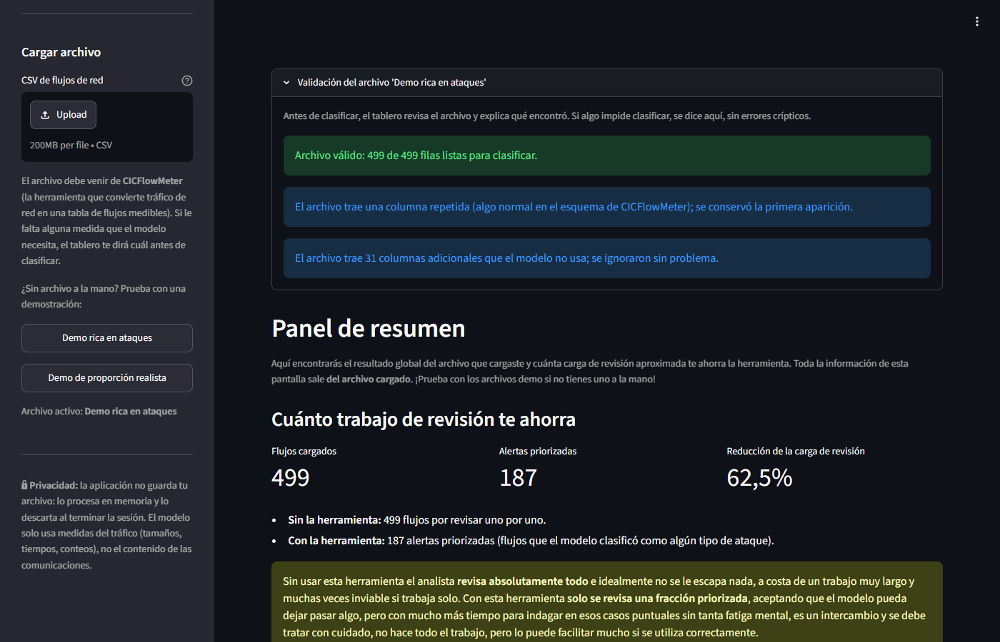
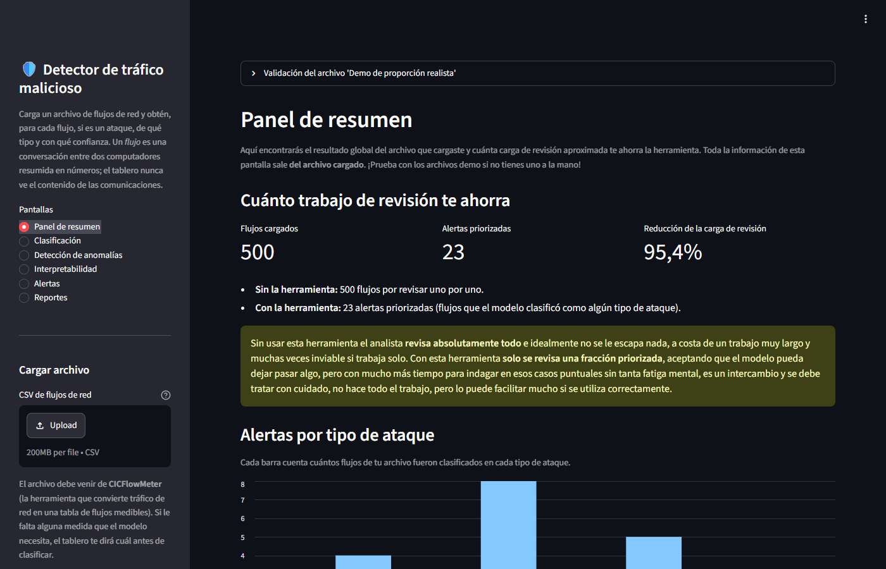
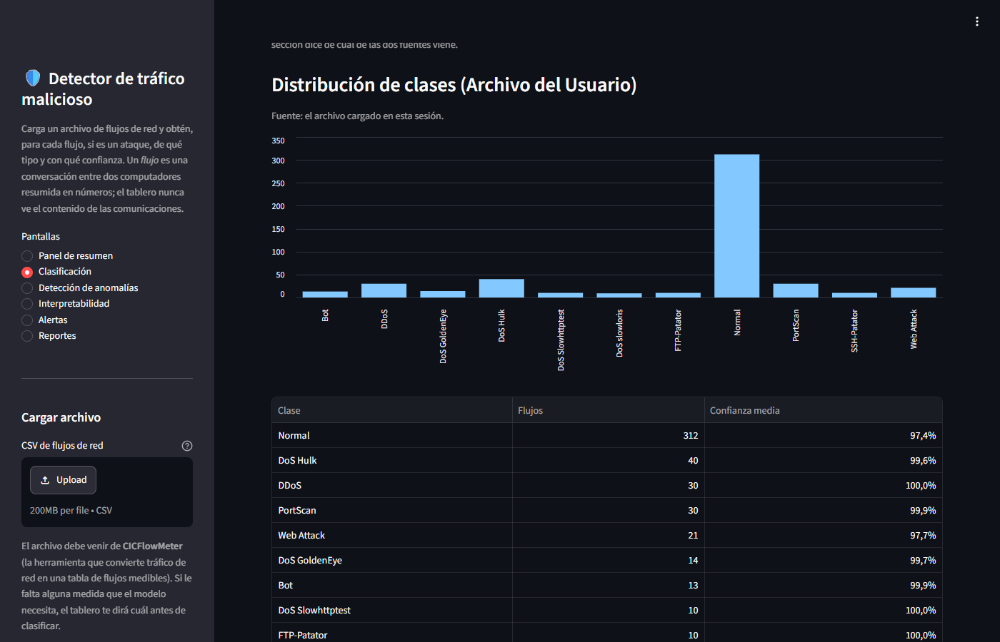
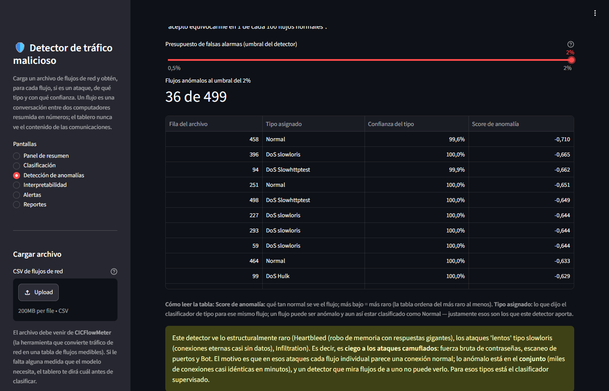
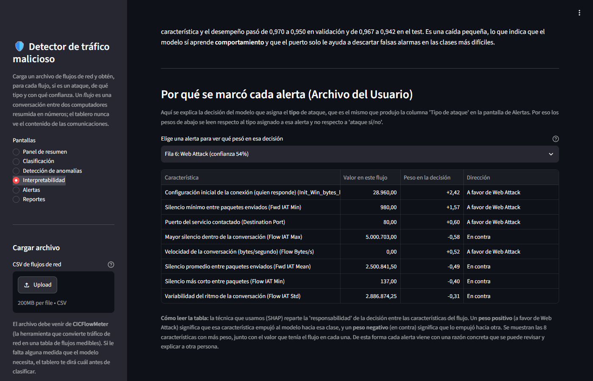
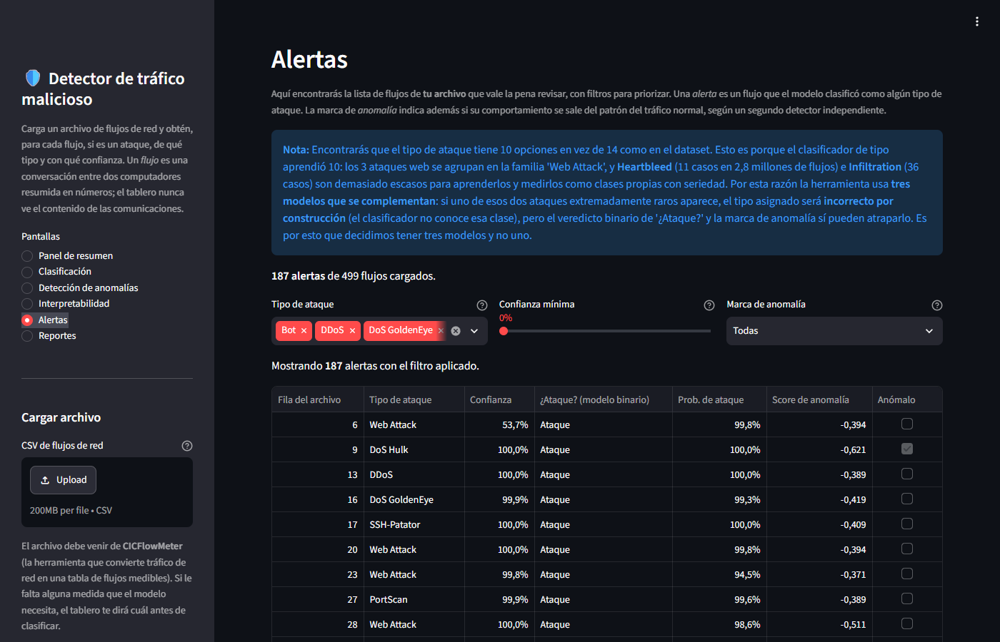
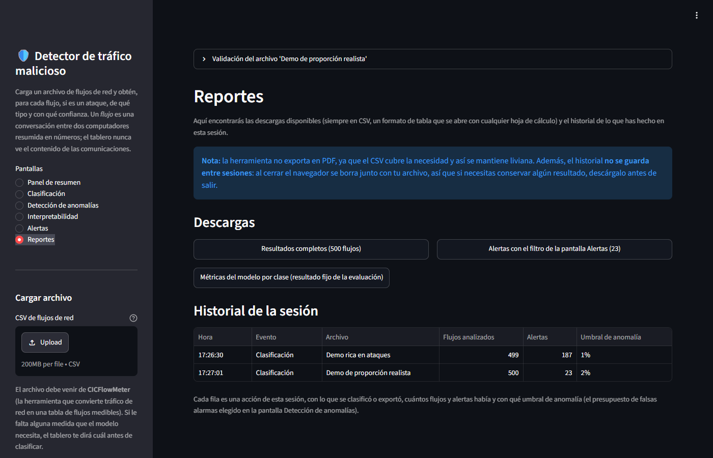

# Manual de usuario del Detector de tráfico malicioso

Proyecto final de la Maestría en Inteligencia Analítica de Datos, Universidad de
los Andes. Equipo: Mariana Pérez, Bryan Rodriguez y Daniela Zúñiga.

Este manual explica qué hace el Detector de tráfico malicioso y cómo usarlo.
Para indicaciones específicas sobre cada pantalla del tablero, diríjase a la
[sección 3](#3-guía-de-uso-pantalla-por-pantalla). Para conocer el tablero le
recomendamos empezar por las dos demostraciones que trae integradas, que se
cargan con un botón (caso de uso 4.1); después podrá analizar sus propios
archivos (caso de uso 4.4).

| Dato | Valor |
|---|---|
| URL pública del tablero | https://deteccion-trafico-malicioso.streamlit.app/ |
| Navegadores | Chrome, Firefox o Edge de escritorio |
| Lectura estimada | Unos 17 minutos |
| Anexos | Diagrama esquemático, reporte técnico, tabla de requerimientos diligenciada, código y pruebas (ver [Anexos](#5-anexos)) |

**Contenido**

1. [Qué es y para qué sirve](#1-qué-es-y-para-qué-sirve)
2. [Antes de empezar](#2-antes-de-empezar)
3. [Guía de uso, pantalla por pantalla](#3-guía-de-uso-pantalla-por-pantalla)
4. [Casos de uso](#4-casos-de-uso)
5. [Anexos](#5-anexos)

---

## 1. Qué es y para qué sirve

El Detector de tráfico malicioso es un tablero web para el analista de un
SOC (centro de operaciones de seguridad, el equipo que vigila la red de una
organización). Le ayuda a decidir qué investigar primero cuando recibe más
tráfico del que puede revisar a mano, con una razón concreta para cada
alerta.

**Qué recibe.** Un archivo CSV (una tabla en texto que abre cualquier hoja de
cálculo) con *flujos de red* sin etiquetar, exportado con CICFlowMeter, la
herramienta gratuita que convierte el tráfico capturado en una tabla de flujos.
Un flujo es una conversación entre dos computadores resumida en números:
cuántos paquetes, de qué tamaño, con qué ritmo y cuánto duró. El tablero nunca
ve el contenido de las comunicaciones.

**Qué devuelve.** Para cada flujo, la respuesta de tres modelos:

| Modelo | Qué le responde a usted |
|---|---|
| Clasificador multiclase | ¿De qué tipo es este flujo? Normal o uno de 10 tipos de ataque, con su confianza |
| Clasificador binario | ¿Es un ataque o no?, con su probabilidad |
| Detector de anomalías | ¿Se ve raro frente al tráfico normal, aunque no se sepa qué es? |

Una *alerta* es un flujo al que el clasificador multiclase le asignó un tipo
de ataque. Las alertas forman la cola de revisión de la pantalla Alertas.

### 1.1 Ventajas

- **Menos carga de revisión.** Usted revisa una fracción priorizada del lote:
  en la demo de proporción realista, 23 alertas en lugar de 500 flujos, es
  decir, 95,4% menos revisión.
- **Poca fatiga de alertas.** El modelo marca como ataque solo 0,12% del
  tráfico normal.
- **Alertas justificables.** Cada alerta trae las 8 variables que más pesaron
  en la decisión, con su valor.
- **Cobertura de ataques no vistos.** El detector de anomalías señala
  comportamientos raros sin haber visto ejemplos de ataque; en la evaluación
  encontró 8 de los 9 flujos de Heartbleed, un ataque que el clasificador no
  pudo aprender.
- **Privacidad.** Solo usa medidas de comportamiento, sin direcciones IP ni
  contenido, y no guarda su archivo.
- **Sin instalación.** Basta un navegador de escritorio y la URL.

### 1.2 Limitaciones y advertencias

**Qué no debe esperar del tablero**

- **Que decida por usted.** Un flujo Normal no está garantizado como benigno;
  solo no superó los criterios del modelo.
- **Que Heartbleed e Infiltration salgan con su tipo correcto.** Son tan
  escasos que el clasificador multiclase no los aprendió y les asigna otro
  tipo, por ejemplo Normal. Búsquelos en la columna "¿Ataque?" de los
  resultados completos (sección 3.7) y en Detección de anomalías (sección 3.4).
- **Que el detector de anomalías vea los ataques camuflados.** En la fuerza
  bruta de contraseñas, el escaneo de puertos y Bot, cada flujo parece normal
  por separado; esos ataques los reconoce el clasificador.
- **Que funcione igual en su red.** Los modelos se entrenaron con tráfico
  simulado de 2017 (CIC-IDS2017), con errores de etiquetado documentados; en
  otra red habría que evaluarlos con su tráfico.
- **Que vigile en tiempo real.** Trabaja por lotes, con los archivos que usted
  carga, y solo acepta el formato de CICFlowMeter.
- **Que guarde su trabajo.** El historial y el archivo se borran al cerrar el
  navegador.

**Qué debe revisar usted**

- **Lo que queda fuera de la cola de alertas.** Alertas solo muestra lo que el
  multiclase marcó como ataque. Lo que dejó como Normal pero el binario o el
  detector marcan, incluidos algunos Bot (el tablero solo anuncia Bot cuando
  está casi seguro), se ve en Detección de anomalías y en los resultados
  completos.
- **La deriva del tráfico normal.** El tráfico normal cambia con el tiempo
  (*deriva*) y el detector marca entonces más de lo presupuestado: en la
  evaluación, un tramo del viernes llegó a 9,6% con un presupuesto de 1%. Si
  le pasa, hay que recalibrar el detector con tráfico normal reciente.

El fundamento de estas limitaciones, con cifras y referencias, está en el
[reporte técnico](../reports/reporte_tecnico_final.pdf): resultados en la
sección 7.1 y riesgos en la sección 8.3.

---

## 2. Antes de empezar

### 2.1 Qué necesita

Un navegador de escritorio (Chrome, Firefox o Edge) y la URL
https://deteccion-trafico-malicioso.streamlit.app/. No hay que instalar nada.
La primera carga tarda unos segundos, y si el tablero llevaba tiempo sin uso,
el alojamiento puede tardar un poco más en reanudarlo.

| Necesita | No necesita |
|---|---|
| Saber qué es un flujo de red y reconocer los tipos de ataque habituales (denegación de servicio, escaneo de puertos, fuerza bruta, botnet) | Programar |
| Para analizar un archivo propio, saber exportar flujos con CICFlowMeter o pedírselos a quien captura el tráfico | Saber estadística ni aprendizaje de máquina: cada pantalla explica sus términos |

### 2.2 Ambiente tecnológico

| Para | Qué se necesita |
|---|---|
| Usar el tablero publicado | Navegador de escritorio moderno y conexión a internet; no está optimizado para celulares |
| Correr el tablero en su equipo | Python 3.13 en Windows, Linux o Mac con procesador Apple, y unos 300 MB de descarga |
| Reproducir el análisis | Python 3.13, unos 8 GB de RAM (sin GPU) y los 8 archivos CSV de CIC-IDS2017 |

### 2.3 Instalación local, actualización y reproducción

**Instalación local (opcional).** Instale `requirements.txt` para usar el
tablero o correr las pruebas, o `requirements-analisis.txt` para reproducir el
análisis, y lance el tablero con `streamlit run streamlit_app.py`. En un Mac
con procesador Intel los entornos no se pueden instalar; use la URL pública.
Los comandos para cada sistema y los problemas frecuentes, como las rutas
largas en Windows, están en
[Correr el tablero paso a paso](../README.md#correr-el-tablero-paso-a-paso).

**Actualización de los modelos.** Los modelos solo cargan de forma confiable
con scikit-learn 1.9.0; con otra versión el tablero muestra una advertencia
amarilla. Para regenerarlos, mueva los tres archivos `.joblib` de `models/` a
otra carpeta (el script no reentrena un modelo cuyo archivo existe), ejecute
`python -m src.modelo_final` con el entorno del análisis y reinicie el
tablero. Más detalle en
[Entornos y dependencias](../README.md#entornos-y-dependencias).

**Reproducir el análisis completo.** Siga en orden
[Reproducir el análisis](../README.md#reproducir-el-análisis), en el README.

### 2.4 Recursos y licencias

Todas las dependencias directas del tablero son de código abierto con
licencias permisivas, compatibles con el uso académico: Apache-2.0
(streamlit), BSD-3-Clause (scikit-learn, pandas, joblib y altair), MIT (shap
y pytest) y, en numpy, BSD-3-Clause con componentes 0BSD, MIT, Zlib y CC0-1.0.
Están en [requirements.in](../requirements.in), y sus versiones y licencias,
en [Licencias de las dependencias](../README.md#licencias-de-las-dependencias).
El tablero publicado se aloja en Streamlit Community Cloud (plan gratuito),
sujeto a sus condiciones de uso.

Los datos son de CIC-IDS2017, del Canadian Institute for Cybersecurity
(https://www.unb.ca/cic/datasets/ids-2017.html), que pide citarlo así:

> Sharafaldin, I., Habibi Lashkari, A. y Ghorbani, A. A. (2018). *Toward
> Generating a New Intrusion Detection Dataset and Intrusion Traffic
> Characterization*. 4th International Conference on Information Systems
> Security and Privacy (ICISSP), Portugal.

---

## 3. Guía de uso, pantalla por pantalla

Las pantallas separan lo que sale de su archivo, rotulado "(Archivo del
Usuario)", de los resultados fijos de la evaluación, rotulados "Resultado
Fijo". Los textos del tablero, que tutean, se citan tal como aparecen.

### 3.1 Barra lateral: cargar una demo o un archivo

*Barra lateral con la demo rica cargada y el recuadro de validación abierto.*

**Qué ve:** la lista "Pantallas", la sección "Cargar archivo" con el cargador
"CSV de flujos de red" y, debajo, "¿Sin archivo a la mano? Prueba con una
demostración:" con los botones **Demo rica en ataques** y **Demo de
proporción realista**.

**Qué puede hacer:**

1. Haga clic en una de las dos demos. En unos segundos el tablero la valida y
   la clasifica, y la barra lateral indica "Archivo activo" con su nombre.
2. Para usar su archivo, arrástrelo al cargador "CSV de flujos de red". El
   tablero lo procesa en memoria y no lo guarda.
3. Abra el recuadro "Validación del archivo '…'", arriba de la pantalla, para
   ver lo que el tablero encontró antes de clasificar (mensajes en el caso
   4.4). Si algo impide clasificar, aparece abierto.
4. Para cambiar de archivo, haga clic en la otra demo o cargue otro CSV. El
   tablero olvida los filtros de Alertas y la alerta elegida en
   Interpretabilidad, y conserva el presupuesto de falsas alarmas.

### 3.2 Panel de resumen

*Panel de resumen con la demo de proporción realista.*

**Qué ve:** bajo "Cuánto trabajo de revisión te ahorra", los indicadores
"Flujos cargados", "Alertas priorizadas" y "Reducción de la carga de
revisión"; un recuadro amarillo sobre el intercambio (se revisa una fracción
priorizada y se acepta que el modelo pueda dejar pasar algo); el gráfico
"Alertas por tipo de ataque" y la sección "Comportamiento anómalo".

**Qué puede hacer:**

- Lea la reducción: el porcentaje de flujos que no necesita revisar uno por
  uno.
- Pase el cursor sobre una barra del gráfico para ver cuántas alertas hay de
  ese tipo.
- "Comportamiento anómalo" cambia si mueve el presupuesto en Detección de
  anomalías (sección 3.4).

### 3.3 Clasificación

*Clasificación con la demo rica en ataques.*

**Qué ve:** "Distribución de clases (Archivo del Usuario)", con un gráfico y
una tabla de cuántos flujos de su archivo quedaron en cada clase; un recuadro
azul que explica por qué el tipo de ataque tiene 10 opciones y no 14; y
"Resultado Fijo: Test Final del modelo", con el desempeño del modelo por
clase.

**Qué puede hacer:**

- Haga clic en el encabezado de una columna para ordenar la tabla.
- Abra "Ver la matriz de confusión (en qué se equivoca el modelo)": cada fila
  es la clase verdadera y cada columna la predicha, así que lo que queda fuera
  de la diagonal son errores.

**Cómo leer las tablas:** **Confianza media** es la probabilidad promedio que
el modelo dio a la clase elegida (99%, casi no dudó; 60%, decisión reñida).
**Detección (recall)** es la fracción de los casos reales que encontró;
**Acierto de la alarma (precisión)**, la fracción de sus anuncios que fueron
correctos; **Calidad del ordenamiento (AP)**, qué tan bien separa la clase (1
es perfecto); y **Casos en la prueba**, con cuántos ejemplos se midió.

### 3.4 Detección de anomalías

*Detección de anomalías con la demo rica y el presupuesto en 2%.*

**Qué ve:** el control **Presupuesto de falsas alarmas (umbral del
detector)**, el indicador "Flujos anómalos al umbral del …", la tabla de los
flujos de su archivo que se salen del patrón normal y, más abajo, "Falsas
alarmas por día: la señal de deriva".

**Qué significa el control.** El detector da a cada flujo un "Score de
anomalía" que dice qué tan normal se ve (más bajo, más raro). Para decidir
cuáles marcar hace falta un corte, y lo fijamos así:

1. Entrenamos el detector solo con el tráfico del lunes del dataset, que es
   100% benigno.
2. Le pedimos puntuar ese mismo tráfico; como sabemos que todo es normal,
   obtenemos la distribución de puntajes del tráfico conocido normal.
3. Fijamos el corte en un percentil de esa distribución, es decir, en el
   puntaje por debajo del cual queda ese porcentaje de los flujos normales. Por
   construcción, ese porcentaje del tráfico conocido normal queda marcado.
4. Todo flujo de su archivo con un puntaje por debajo del corte se marca como
   anómalo.

Por eso el control es un **presupuesto explícito de falsas alarmas**: elegir
1% es aceptar que el detector se equivoque en 1 de cada 100 flujos normales.
Ofrece 0,5%, 1% (el valor inicial) y 2%.

**Qué puede hacer:**

- Mueva el control a 2%: el indicador sube, porque el detector se vuelve más
  sensible y acepta más falsas alarmas. Con 0,5% baja. El valor se mantiene al
  cambiar de pantalla y se aplica también a Alertas y al Panel de resumen.
- En la tabla, ordenada del más raro al menos raro, fíjese en los flujos con
  tipo Normal: son los que este detector aporta.

**Cómo leer las tablas:** **Score de anomalía**, más bajo, más raro; **Tipo
asignado**, lo que dijo el multiclase. En la tabla por día, que sigue al
control, **Falsas alarmas** es la fracción del tráfico normal de cada tramo
que el detector marcó; si se aleja del presupuesto, hubo deriva (con 1%, un
tramo del viernes llega a 9,6%).

### 3.5 Interpretabilidad

*Interpretabilidad con una alerta de la demo rica seleccionada.*

**Qué ve:** "Resultado Fijo: Qué distingue un ataque del tráfico normal", con
las 10 variables de las que más depende el modelo, y la "Prueba del puerto de
destino". Abajo, "Por qué se marcó cada alerta (Archivo del
Usuario)".

**Qué puede hacer:**

- Elija una alerta en el selector "Elige una alerta para ver qué pesó en esa
  decisión" (cada opción muestra fila, tipo y confianza). La elección se
  conserva al cambiar de pantalla y se reinicia al cambiar de archivo.

**Cómo leer la tabla de la alerta:** muestra las 8 variables que más pesaron
según SHAP, una técnica que reparte la "responsabilidad" de la decisión entre
las variables. **Valor en este flujo** es la medida del flujo; **Peso en la
decisión**, cuánto empujó (positivo, hacia el tipo asignado; negativo, hacia
otra clase); y **Dirección** lo dice en palabras. Explica al multiclase; la
tabla general de arriba, al binario.

### 3.6 Alertas

*Alertas con la demo rica y sus tres filtros.*

**Qué ve:** la cola de alertas de su archivo (los flujos con un tipo de ataque
asignado por el multiclase), tres filtros y una tabla.

**Qué puede hacer:**

- En **Tipo de ataque**, quite los tipos que no quiere revisar; la tabla y el
  conteo "Mostrando … alertas con el filtro aplicado" se actualizan al
  instante.
- Mueva **Confianza mínima** a la derecha para ocultar las alertas en que el
  modelo dudó más; con 0% se ven todas.
- En **Marca de anomalía**, elija "Solo anómalas" para ver solo las que además
  marcó el detector, o "Solo no anómalas".
- Haga clic en **Descargar estas alertas en CSV** para exportar lo que ve. El
  filtro se conserva al cambiar de pantalla (Reportes lo usa) y se reinicia al
  cambiar de archivo.

**Cómo leer la tabla:** **Fila del archivo** es la posición del flujo en su
CSV (la primera fila de datos es la 1); **Tipo de ataque** y **Confianza**
vienen del multiclase; **¿Ataque? (modelo binario)** y **Prob. de ataque**,
del binario; **Anómalo** y **Score de anomalía**, del detector.

### 3.7 Reportes

*Reportes con las descargas y el historial de la sesión.*

**Qué ve:** la sección "Descargas", con tres botones, y el "Historial de la
sesión". Un recuadro azul recuerda que no hay exportación en PDF y que el
historial no se guarda entre sesiones.

**Qué puede hacer:**

- Haga clic en **Resultados completos (… flujos)** para bajar todos los
  flujos, incluidos los que quedaron como Normal. Su columna "¿Ataque?" le
  muestra lo que quedó fuera de la cola de alertas.
- Haga clic en **Alertas con el filtro de la pantalla Alertas (…)** para bajar
  las alertas con el filtro vigente (todas, si no ha filtrado). Pase el cursor
  sobre el botón para ver el filtro.
- Haga clic en **Métricas del modelo por clase (resultado fijo de la
  evaluación)** para bajar el desempeño del modelo por clase.
- Revise el "Historial de la sesión" antes de salir: cada fila es una
  clasificación o exportación, con su archivo, flujos, alertas y umbral.

**Nota:** las descargas son CSV con punto decimal, para otras herramientas.

---

## 4. Casos de uso

Cada caso encadena pantallas; el detalle de cada una está en la sección 3.

### 4.1 Cargar las demos para conocer el tablero

Es la forma más rápida de conocer el tablero, porque no necesita un archivo
propio. Las demos son muestras pequeñas de CIC-IDS2017 tomadas del conjunto de
prueba, es decir, de flujos que los modelos no vieron al entrenar. La rica en
ataques muestra todo lo que el tablero detecta, y la de proporción realista,
cuánto trabajo de revisión ahorra en un lote parecido al tráfico real.

| Demo | Flujos | Ataque | Tipos de ataque | Etiquetas para comprobar |
|---|---|---|---|---|
| **Demo rica en ataques** | 499 | 39,9% | 14 | [`data/demo/etiquetas_demo.csv`](../data/demo/etiquetas_demo.csv) |
| **Demo de proporción realista** | 500 | 5,0% | 10 | [`data/demo/etiquetas_demo_realista.csv`](../data/demo/etiquetas_demo_realista.csv) |

1. Abra el tablero y haga clic en **Demo rica en ataques** (sección 3.1).
2. Recorra en orden las seis pantallas (secciones 3.2 a 3.7).
3. Haga clic en **Demo de proporción realista** y vuelva al Panel de resumen:
   500 flujos cargados, 23 alertas priorizadas y 95,4% menos revisión.
4. Para comprobar un resultado, anote la "Fila del archivo" de una alerta y
   búsquela en el archivo de etiquetas de esa demo: la columna `fila` usa la
   misma numeración y `etiqueta_real` trae la respuesta correcta. El tablero no
   lee estos archivos.

**Nota:** comparando todas las filas, el tablero acierta si un flujo es ataque
o normal en 487 de 499 flujos de la demo rica (97,6%) y en 498 de 500 de la
realista (99,6%). Esa coincidencia le permite comprobar por su cuenta que las
demos reflejan lo que hacen los modelos. No la use como medida de desempeño,
porque las demos tienen una
cantidad fija de flujos por tipo de ataque y no representan la mezcla real del
tráfico. El desempeño está en la sección 7.1 del
[reporte técnico](../reports/reporte_tecnico_final.pdf).

### 4.2 Justificar una alerta ante otra persona

1. Cargue la **Demo rica en ataques** o su archivo (sección 3.1).
2. En Alertas, anote la "Fila del archivo" de la alerta (sección 3.6).
3. En Interpretabilidad, elija esa fila en el selector (sección 3.5).
4. Anote la fila, el tipo, la confianza y las dos o tres variables con más
   peso a favor, con su valor: esa es la razón de la alerta.
5. Si hacen falta los datos, descargue las alertas en CSV y señale la fila.

### 4.3 Ajustar la sensibilidad del detector

1. Cargue la **Demo rica en ataques** y vaya a Detección de anomalías
   (sección 3.4).
2. Mueva el control entre 0,5%, 1% y 2%: el indicador pasa de 8 a 22 y a 36
   de 499 flujos.
3. Con 2%, busque la fila 491: tiene tipo Normal, pero en
   `data/demo/etiquetas_demo.csv` es Heartbleed, y solo aparece como anómala
   con el presupuesto en 2%.
4. Revise en "Falsas alarmas por día" cuántas falsas alarmas implica cada
   presupuesto.
5. Deje el presupuesto que su equipo pueda revisar; se aplica también a
   Alertas y al Panel de resumen y queda en el "Historial de la sesión".

### 4.4 Analizar un archivo propio (opcional)

El archivo tiene que ser un CSV de CICFlowMeter con los nombres de columna de
CIC-IDS2017. En el tablero publicado, un lote de 50.000 flujos (15,6 MB) se
clasifica en menos de 2 segundos después de terminar la subida, y en una
instalación local tarda unos 2 segundos la primera vez y unos 0,6 segundos las
siguientes.

1. Cargue su CSV en "CSV de flujos de red" (sección 3.1).
2. Abra "Validación del archivo '…'" y revise los mensajes:

   | Mensaje (inicio) | Qué significa y qué hacer |
   |---|---|
   | "Archivo válido: …" | Dice cuántas filas quedaron listas; puede seguir |
   | "Faltan … de las 46 características que el modelo necesita" | El archivo no viene de CICFlowMeter o le quitaron columnas, así que no se clasifica; vuelva a exportarlo sin quitar columnas |
   | "… filas traen valores faltantes o infinitos" o "Se encontraron … valores que no son números" | Esas filas se excluyen (el mensaje dice cuáles) y el resto se clasifica |
   | "El archivo está vacío", "… ninguna fila de datos" o "No se pudo leer el archivo como CSV" | No hay nada que clasificar; revise la exportación |
   | Avisos sobre la columna de etiqueta, columnas adicionales o una columna repetida | Se ignoran sin problema |

3. En el Panel de resumen, vea cuántas alertas hay (sección 3.2).
4. En Alertas, filtre y descargue lo que va a investigar (sección 3.6).
5. En Reportes, descargue los resultados completos para revisar también lo que
   quedó fuera de la cola (sección 3.7).
6. Antes de cerrar el navegador, descargue lo que necesite conservar.

---

## 5. Anexos

| Anexo | Archivo | Qué contiene |
|---|---|---|
| A. Diagrama esquemático | [diagrama_esquematico.png](diagrama_esquematico.png) | Cómo se construyó la solución y qué pasa con cada archivo al usar el tablero |
| B. Reporte técnico | [reporte_tecnico_final.pdf](../reports/reporte_tecnico_final.pdf) | Modelos, alternativas, supuestos, validación, resultados, estado de implementación y apéndices |
| C. Tabla de requerimientos diligenciada | [tabla_requerimientos_diligenciada.xlsx](tabla_requerimientos_diligenciada.xlsx) | Los 22 requerimientos con su resultado, estado, evidencia, ajustes y acción correctiva |
| D. Código y pruebas | [streamlit_app.py](../streamlit_app.py), [app/](../app/), [src/](../src/), [notebooks/](../notebooks/) y [tests/](../tests/README.md) | El tablero, el pipeline del análisis, los notebooks ejecutados y las 25 pruebas de los requerimientos (19 automatizadas y 6 manuales) |

